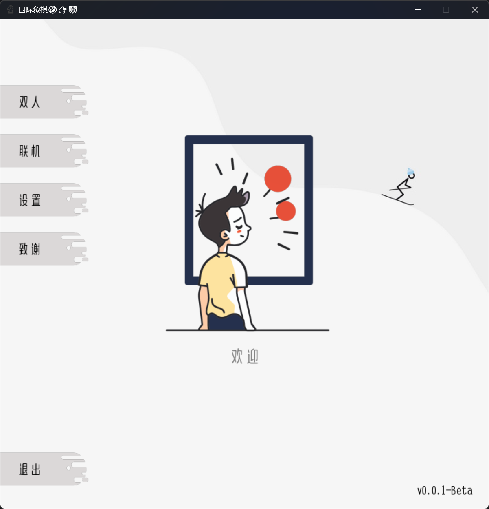

#  国际象棋-Pygame 

## 简介
[国际象棋](https://github.com/oldsky11/chess)的pygame重构版，也是一个它的测试分支

## 更新日志
[点我查看](https://github.com/oldsky11/chess/blob/pygame/CHANGELOG.md)

## 版本
>释放版本:`无`  
>Beta版本:`v0.0.2-Beta`

## 语言
>Python

## 依赖库
>- pygame  

## 贡献者
